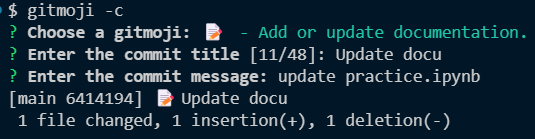

# Docker

### Docker

<figure><figcaption></figcaption></figure>

<figure><figcaption></figcaption></figure>

<figure><figcaption>
Layer 0 -> Layer 6
</figcaption></figure>

<figure><figcaption></figcaption></figure>

